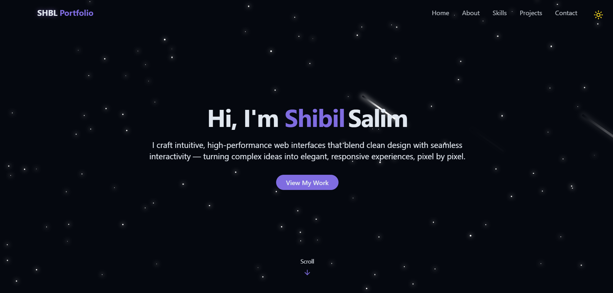

# Portfolio Website with React & TailwindCSS

   
    
   
  

## ⚙️ Tech Stack

- **React** – Component-based UI development
- **Vite** – Lightning-fast build tool
- **TailwindCSS** – Utility-first CSS for styling
- **Lucide Icons** – Clean and beautiful icon pack
- **Radix UI** – Accessible component primitives
- **GitHub & Vercel** – Deployment

---

## ⚡️ Features

- 🌑 **Light/Dark Mode Toggle**
  Save theme preference in local storage with beautiful transitions

- 💫 **Animated Backgrounds**
  Stars, meteors, scroll effects, and glowing UI elements

- 📱 **Responsive Navigation**
  Desktop and mobile menus with glassmorphism

- 📊 **Skills Grid**
  Filterable progress bars and categories with animated width

- 📩 **Contact Section**
  responsive contact form with toast notifications

- 🚀 **One-Click Deployment**
  Easily host your site with Vercel and GitHub

---